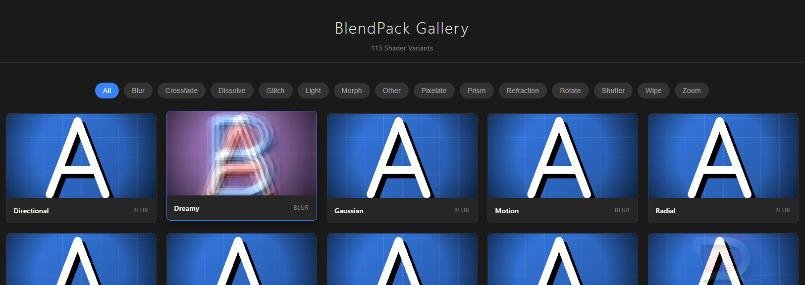

# ComfyUI BlendPack

Video transition effects for ComfyUI using WebGL rendering.

## What is this?


BlendPack lets you create smooth video transitions between two clips. It uses WebGL for fast rendering in the browser and falls back to ModernGL on the backend when needed.


https://github.com/user-attachments/assets/5ea617d9-e88a-4bf1-9707-ac267023654a


There are 100+ transition variants across different categories like dissolve, wipe, zoom, blur, glitch, etc.

**Preview Gallery:** [Live Demo (GitHub Pages)](https://SKBv0.github.io/ComfyUI_BlendPack/previews/gallery.html)



## Installation

```bash
cd ComfyUI/custom_nodes/
git clone https://github.com/SKBv0/ComfyUI_BlendPack.git
cd ComfyUI_BlendPack
pip install -r requirements.txt
```

Restart ComfyUI after installation.

## Usage

1. Load two video clips using `LoadVideo` or similar nodes
2. Connect both to the `BlendJoiner` node
3. Select an engine (Dissolve, Wipe, Zoom, etc.) and a variant
4. Adjust duration, intensity, and FPS as needed
5. Enable "Real Preview" to see the transition live
6. Connect to `BlendVideoCombine` to export the result

## Available Effects

| Engine | Examples |
|--------|----------|
| Dissolve | powder, ink, cellular, bokeh, fractal, ... |
| Wipe | left, right, radial, spiral, iris, ... |
| Zoom | zoom_in, zoom_out, zoom_blur, zoom_rotate, ... |
| Light | soft_leak, glow_veil, exposure_roll, ... |
| Rotate | rotate_cw, rotate_3d, rotate_swirl, ... |
| Blur | gaussian, motion, radial, dreamy, ... |
| Glitch | scan_jitter, line_tear, block_drift, ... |
| Morph | smooth, warp, liquify, twist, ... |
| Pixelate | block, dither, 8bit, mosaic, ... |
| Prism | rgb_split, spectral_smear, chroma_pulse, ... |
| Refraction | glass_ripple, heat_haze, micro_lens, ... |
| Shutter | directional_smear, frame_echo, time_ghost, ... |
| Other | kaleidoscope, liquid_metal, aurora, ink_in_water, ... |

> **Note:** There are currently **100+ variants** across all engines. Check the gallery for the full list.

## Adding Custom Shaders

Create a file in `js/engine/shaders/` (e.g., `myeffect.glsl.js`):

```javascript
import { SHADER_COMMON } from './common.glsl.js';

export const MYEFFECT_VARIANTS = {
    simple: {
        uniforms: { uSpeed: 1.0 },
        description: "Simple effect",
        fragment: `
            ${SHADER_COMMON}
            uniform float uSpeed;

            void main() {
                vec4 colorA = texture2D(uTexA, vUv);
                vec4 colorB = texture2D(uTexB, vUv);
                gl_FragColor = mix(colorA, colorB, uProgress);
            }
        `
    }
};

export default MYEFFECT_VARIANTS;
```

Then register it in `js/engine/shaders/index.js`:

```javascript
import { MYEFFECT_VARIANTS } from './myeffect.glsl.js';

export { MYEFFECT_VARIANTS };

export const ALL_ENGINES = {
    // ... existing engines
    MyEffect: MYEFFECT_VARIANTS
};
```

Restart ComfyUI and your new effect will appear in the dropdown.

## Built-in GLSL Functions

The `SHADER_COMMON` include provides:

- **Noise:** `noise()`, `fbm()`, `voronoi()`, `snoise()`
- **Transform:** `rotate2D()`, `swirl()`, `barrelDistort()`
- **Easing:** `easeInOutCubic()`, `easeOutBounce()`, etc.
- **Uniforms:** `uTexA`, `uTexB`, `uProgress`, `uIntensity`, `uTime`, `vUv`


## Project Structure

```
ComfyUI_BlendPack/
├── __init__.py          # Plugin entry
├── nodes.py             # Node definitions
├── gpu_renderer.py      # ModernGL backend
├── js/
│   ├── blendpack_entry.js
│   ├── core/            # State management
│   ├── engine/          # Shader system
│   ├── renderer/        # WebGL rendering
│   ├── ui/              # UI components
│   └── utils/           # Helpers
└── previews/            # Gallery and demo videos
```

## License

MIT
